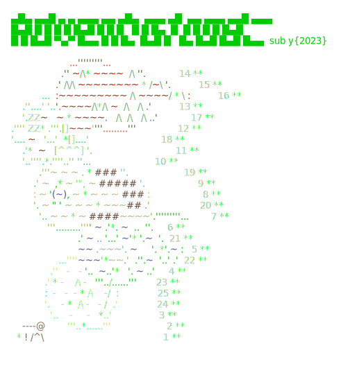

# Advent of Code (2023-2023)
C# solutions to the Advent of Code problems.
Check out https://adventofcode.com.

<a href="https://adventofcode.com"></a>

All credit for the Lib goes to [encse](https://github.com/encse).

## Dependencies

- This project is based on `.NET 8`  and `C# 12`. It should work on Windows, Linux and OS-X.
- `AngleSharp` is used for problem download.

## Running

To run the project:

1. Install .NET Core
2. Clone the repo
3. Get help with `dotnet run`
```

Usage: dotnet run [arguments]
1) To run the solutions and admire your advent calendar:

 [year]/[day|all]      Solve the specified problems
 today                 Shortcut to the above
 [year]                Solve the whole year
 all                   Solve everything

 calendars             Show the calendars

2) To start working on new problems:
login to https://adventofcode.com, then copy your session cookie, and export 
it in your console like this

 export SESSION=73a37e9a72a...

then run the app with

 update [year]/[day]   Prepares a folder for the given day, updates the input,
                       the readme and creates a solution template.
 update today          Shortcut to the above.

3) To upload your answer:
set up your SESSION variable as above.

 upload [year]/[day]   Upload the answer for the selected year and day.
 upload today          Shortcut to the above.


```

## Working in Visual Studio Code
If you prefer, you can work directly in VSCode as well. 
 
 Open the command Palette (⇧ ⌘ P), select `Tasks: Run Task` then e.g. `update today`.

 Work on part 1. Check the solution with the `upload today` task. Continue with part 2.

 **Note:** this feature relies on the "Memento Inputs" extension to store your session cookie, you need 
 to set it up in advance from the Command Palette with `Install Extensions`.
